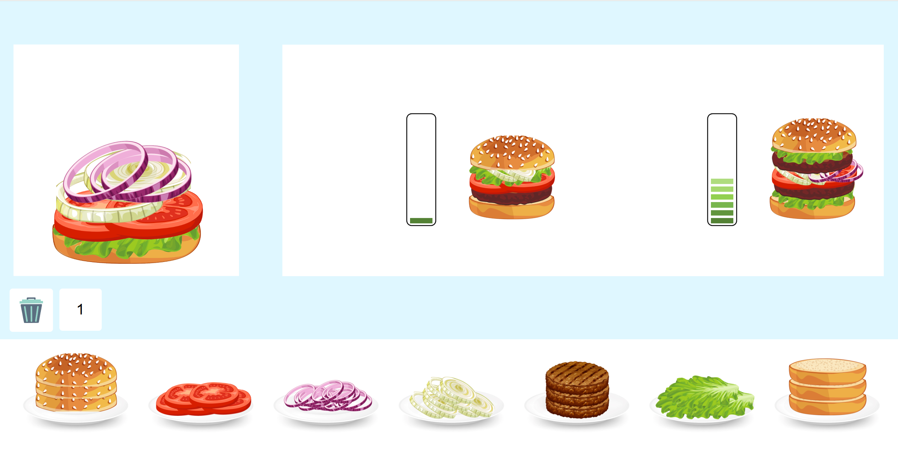

# 🍔 Hamburger Builder Game

This is a fun and interactive hamburger-building game created using **HTML**, **CSS**, and **JavaScript**.

Players receive random hamburger orders and must stack the correct ingredients in the right order to win. The game also includes a countdown timer, sound effects, and login/registration using **localStorage**.

---

## 🎮 Features

- 👨‍🍳 Drag-and-drop hamburger building
- ⏱️ Countdown timer with animated numbers
- 🔊 Sound effects for win, click, and game over
- 👥 User login and registration using `localStorage`
- 🗑️ Trash bin to reset a wrong burger
- 🧾 Random dynamic orders with timing

---

## 🚀 How to Run

1. Clone the repository:
   ```bash
   git clone https://github.com/yafi321/Hamburger-game.git

2. Open the project folder in your browser:

Start with join.html to register or log in.

After login, the game will automatically load.

---

## 🛠️ Technologies Used

- HTML5
- CSS3
- JavaScript (Vanilla)
- LocalStorage API

---

## 📸 Screenshots

### 🔐 Login Page  


### 🎮 Gameplay  



---

##  Credits
Developed by Yafa Farkash, Margalit and Racheli Kluger – as part of a JavaScript mini-game project.


